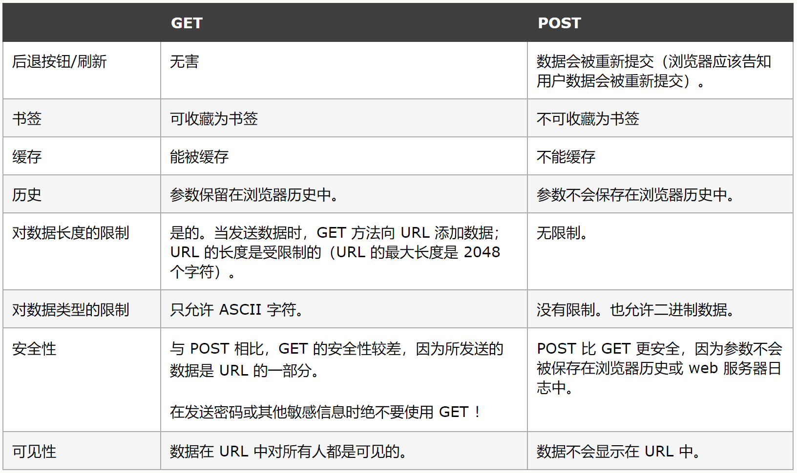

## GET请求与POST请求

### 前言
> HTTP设定了八种发送请求方式（也称为八大“动作”）。这八种方法没有任何本质上的区别。只是让请求，更加有语义化而已。
八种方法分别为：OPTIONS、HEAD、GET、POST、PUT、DELETE、TRACE、CONNECT
这八种方法最终经过“岁月沉淀”后，最常用的是这两种：GET、POST

### GET
    1. 含义：从指定的资源获取数据（一种“索取”的感觉）。
    2. 什么时候使用GET请求较为合适？
        (1)单纯获取数据的时。
        (2)请求非敏感数据时。

### POST
    1.含义：向指定的资源提交要被处理的数据（一种“交差”的感觉）。
    2.什么时候使用POST请求较为合适？
        (1)传送相对敏感数据时。
        (2)请求的结果有持续性的副作用，例如：传递的数据要写入数据库时。
        备注：使用了POST不代表的绝对的安全。
        
### 常见的GET请求：
    1.浏览器地址栏输入网址时（即浏览器请求页面时，且无法手动更改）。
    2.可以请求外部资源的html标签，例如： <a> <link> <script>，且无法手动更改。
    3.发送Ajax时若没有指定发送请求的方式，则使用GET方式，或者明确指出了使用GET请求。
    4.form表单提交时，若没有指明方式，默认使用GET。
    
### 常见的POST请求：
    1.发送Ajax时,明确指出了使用POST方式时。
    2.form表单提交时明确指出使用POST方式
    
###二者的区别

    
